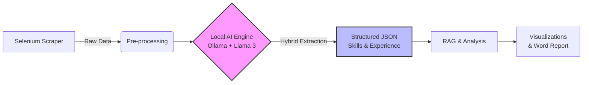

# LinkedIn Jobs Pipeline

**An end-to-end, AI-powered data engineering pipeline**: From scraping raw job postings to Local LLM extraction, semantic analysis, and reporting.

It integrates:  
- [linkedin-jobs-scraper](https://github.com/YuliaShiyy/Linkedin-Jobs-Sweden-Scraper) (Data Ingestion)  
- [linkedin-jobs-analysis](https://github.com/yuliashiyy/linkedin-jobs-analysis) (Local AI & RAG Engine) 

---

## 🔗 The AI-Enhanced Workflow
The pipeline has evolved from simple rule-based cleaning to a Hybrid AI Architecture:
Phase 1:
 ```mermaid
 flowchart LR
    A[Scraper] --> B[Raw Job Data CSV]
    B --> C[Data Cleaning +  LLM/Rule-based Enrichment]
    C --> D[Analysis & Visualizations]
    D --> E[Word Report]
```
Phase 2:

---

## 📊 Key Features

1. Data Ingestion (Scraping)
 - Automated Scraping: Selenium-based crawler for LinkedIn Sweden.

 - Robustness: Handles pagination, login handling, and anti-bot measures.

2. AI Processing (The Upgrade) ✨
 - Local LLM Integration: Uses Ollama (Llama 3.2) for privacy-preserving processing.

 - Hybrid Extraction: Combines Regex (for metadata) + AI (for semantic skill extraction).

 - Semantic Normalization: Auto-translates and standardizes multi-lingual (Swedish/English) titles.

3. Analytics & Reporting
 - Competitiveness Metric: Calculates applications per day to gauge market heat.

 - Local RAG: "Chat-with-Data" capability using Vector Search.

 - Automated Reporting: Generates a Word document summary of key insights.

---

## 📂 Project Structure

    linkedin-jobs-pipeline/
    │
    ├── scraping/            # Submodule: Selenium Scraper
    ├── analysis/            # Submodule: Local AI & RAG Engine
    ├── data/                # Sample datasets for reproducibility
    ├── report/              # Final Word report
    ├── requirements.txt
    └── README.md

## ⚙️ Requirements
Core dependencies include:

 - Python 3.10+

 - Ollama (Running llama3.2)

 - Selenium & LangChain

See requirements.txt for full dependencies.

---

## 🚀 Usage
### Phase 1:

1. Scraping
   ```bash
   cd scraping
   python main.py
  This generates raw job postings into CSV.

2. Analysis
   ```bash
    cd analysis/notebooks
    jupyter notebook analysis.ipynb
  This cleans data, produces visualizations, and generates the report.

3. Outputs

  - Cleaned dataset under /analysis/data/
  
  - Visualizations under /analysis/visualizations/
  
  - Report under /analysis/report/

### Phase 2:
Process the data using the Local AI engine:
```bash
 cd analysis
 # Ensure Ollama is running: `ollama run llama3.2`
 jupyter notebook notebooks/ai_features_demo.ipynb
 ```
This step extracts structured skills, performs RAG queries, and updates visualizations.

---

## ⚠️ Data Disclaimer

Due to LinkedIn’s Terms of Service, raw scraped data is not shared in this repository.
Instead, we provide a sample dataset for reproducibility, along with the cleaned dataset used in the analysis.

---

## 📌 Related Repositories

- [LinkedIn Jobs Scraper](https://github.com/yuliashiyy/linkedin-jobs-scraper)  
- [LinkedIn Jobs Analysis](https://github.com/yuliashiyy/linkedin-jobs-analysis)  


  
